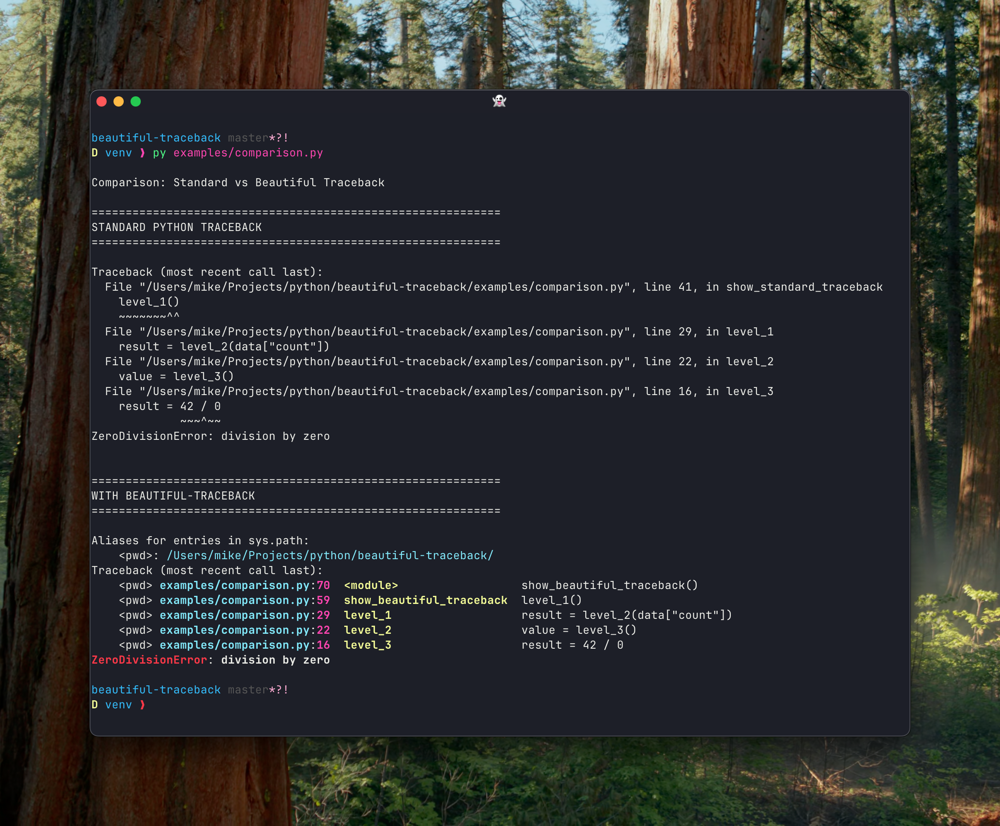

# Beautiful, Readable Python Stack Traces

[](https://github.com/iloveitaly/beautiful-traceback/releases)
[](https://pepy.tech/project/beautiful-traceback)
[](https://pypi.org/project/beautiful-traceback)

[](https://opensource.org/licenses/MIT)

Human readable stacktraces for Python.



> [!NOTE]
> This is a fork of the [pretty-traceback](https://github.com/mbarkhau/pretty-traceback) repo with simplified development and improvements for better integration with FastAPI, [structlog](https://github.com/iloveitaly/structlog-config), IPython, pytest, and more. This project is used in [python-starter-template](https://github.com/iloveitaly/python-starter-template) to provide better debugging experience in production environments.

## Quick Start

The fastest way to see it in action:

```bash
# Clone and run an example
git clone https://github.com/iloveitaly/beautiful-traceback
cd beautiful-traceback
uv run examples/simple.py
```

## Overview

Beautiful Traceback groups together what belongs together, adds coloring and alignment. All of this makes it easier for you to see patterns and filter out the signal from the noise. This tabular format is best viewed in a wide terminal.


## Installation

```bash
uv add beautiful-traceback
```

## Usage

Add the following to your `__main__.py` or the equivalent module which is your entry point.

```python
try:
    import beautiful_traceback
    beautiful_traceback.install()
except ImportError:
    pass    # no need to fail because of missing dev dependency
```

Please do not add this code e.g. to your `__init__.py` or any other module that your users may import. They may not want you to mess with how their tracebacks are printed.

If you do feel the overwhelming desire to import the `beautiful_traceback` in code that others might import, use `BEAUTIFUL_TRACEBACK_ENABLED` to gate activation:

```python
try:
    import beautiful_traceback
    beautiful_traceback.install()
except ImportError:
    pass    # no need to fail because of missing dev dependency
```

Then set `BEAUTIFUL_TRACEBACK_ENABLED=true` in environments where you want it active.

Note, that the hook is only installed if the existing hook is the default. Any existing hooks that were installed before the call of `beautiful_traceback.install` will be left in place.

## LoggingFormatter

A `logging.Formatter` subclass is also available (e.g. for integration with Flask, FastAPI, etc).

```python
import os
from flask.logging import default_handler

try:
    if os.getenv('FLASK_DEBUG') == "1":
        import beautiful_traceback
        default_handler.setFormatter(beautiful_traceback.LoggingFormatter())
except ImportError:
    pass    # no need to fail because of missing dev dependency
```

## IPython and Jupyter Integration

Beautiful Traceback works seamlessly in IPython and Jupyter notebooks:

```python
# Load the extension
%load_ext beautiful_traceback

# Unload if needed
%unload_ext beautiful_traceback
```

The extension automatically installs beautiful tracebacks for your interactive session.

## Pytest Integration

Beautiful Traceback includes a pytest plugin that automatically enhances test failure output.

### Automatic Activation

The plugin activates automatically when `beautiful-traceback` is installed. No configuration needed!

### Configuration Options

Customize the plugin in your `pytest.ini` or `pyproject.toml`:

```toml
[tool.pytest.ini_options]
enable_beautiful_traceback = true                    # Enable/disable the plugin
enable_beautiful_traceback_local_stack_only = true   # Show only local code (filter libraries)
beautiful_traceback_exclude_patterns = [             # Regex patterns to drop frames
  "click/core\\.py",
]
```

Or in `pytest.ini`:

```ini
[pytest]
enable_beautiful_traceback = true
enable_beautiful_traceback_local_stack_only = true
beautiful_traceback_exclude_patterns =
    click/core\.py
```

Example: filter out pytest, pluggy, and playwright frames from CI tracebacks:

```toml
[tool.pytest.ini_options]
beautiful_traceback_exclude_patterns = [
  "^_pytest/",
  "^pluggy/",
  "^playwright/",
]
```

**Pattern Matching:** Patterns are tested against multiple representations of each frame:
- `_pytest/runner.py` (short module path)
- `/path/to/site-packages/_pytest/runner.py` (full module path)
- `<site> _pytest/runner.py:353 from_call result: ...` (formatted line with short path)
- `<site> /path/to/.../runner.py:353 from_call result: ...` (formatted line with full path)

This allows you to write simpler patterns like `^_pytest/` instead of needing to match the full site-packages path.

## Threading Support

`beautiful_traceback.install()` hooks both `sys.excepthook` and `threading.excepthook`, so unhandled exceptions in background threads are automatically formatted.

- Thread name and daemon status are shown in the exception header (e.g., `Exception in thread Worker-1 (daemon):`)
- `exc_to_json()` accepts an optional `thread` parameter to include thread metadata in structured JSON output

See [`examples/threading_example.py`](examples/threading_example.py) for a complete demonstration.

## Examples

Check out the [examples/](examples/) directory for basic usage, exception chaining, logging integration, and more.

## Configuration

### Installation Options

Beautiful Traceback supports several configuration options:

```python
beautiful_traceback.install(
    color=True,                            # Enable colored output
    only_tty=True,                         # Only activate for TTY output
    only_hook_if_default_excepthook=True,  # Only install if default hook
    local_stack_only=False,                # Filter to show only local code (overrides BEAUTIFUL_TRACEBACK_LOCAL_STACK_ONLY)
    exclude_patterns=["click/core\\.py"],  # Regex patterns to drop frames
)
```

### Environment Variables

- **`NO_COLOR`** - Disables colored output when set (respects [no-color.org](https://no-color.org) standard)
- **`BEAUTIFUL_TRACEBACK_ENABLED`** - Set to `false`/`0`/`no` to disable. Useful when install() is called in shared code.
- **`BEAUTIFUL_TRACEBACK_LOCAL_STACK_ONLY`** - Set to `true`/`1`/`yes` to filter out library/framework frames.
- **`BEAUTIFUL_TRACEBACK_SHOW_ALIASES`** - Set to `false`/`0`/`no` to hide the sys.path aliases section.

These env vars serve as fallback defaults for both `install()` and the pytest plugin (CLI args and `pytest.ini` settings take precedence over env vars for pytest).

### LoggingFormatterMixin

For more advanced logging integration, you can use `LoggingFormatterMixin` as a base class:

```python
import logging
import beautiful_traceback

class MyFormatter(beautiful_traceback.LoggingFormatterMixin, logging.Formatter):
    def __init__(self):
        super().__init__(fmt='%(levelname)s: %(message)s')
```

This gives you full control over the log format while adding beautiful traceback support.

## Global Installation via PTH File

You can enable beautiful-traceback across all Python projects without modifying any source code by using a `.pth` file. Python automatically executes import statements in `.pth` files during interpreter startup, making this perfect for development environments.

### Using the CLI Command

The easiest way to inject beautiful-traceback into your current virtual environment:

```bash
beautiful-traceback
```

This command:
- Only works within virtual environments (for safety)
- Installs the `.pth` file into your current environment's site-packages
- Displays the installation path every time it runs

Output:
```
Beautiful traceback injection installed: /path/to/.venv/lib/python3.11/site-packages/beautiful_traceback_injection.pth
```

### Using a Shell Function (Alternative)

Alternatively, add this function to your `.zshrc` or `.bashrc`:

```bash
# Create a file to automatically import beautiful-traceback on startup
python-inject-beautiful-traceback() {
  local site_packages=$(python -c "import site; print(site.getsitepackages()[0])")

  local pth_file=$site_packages/beautiful_traceback_injection.pth
  local py_file=$site_packages/_beautiful_traceback_injection.py

  cat <<'EOF' >"$py_file"
def run_startup_script():
  try:
    import beautiful_traceback
    beautiful_traceback.install(only_tty=False)
  except ImportError:
    pass

run_startup_script()
EOF

  echo "import _beautiful_traceback_injection" >"$pth_file"
  echo "Beautiful traceback injection created: $pth_file"
}
```

After sourcing your shell config, run `python-inject-beautiful-traceback` to enable beautiful tracebacks globally for that Python environment.

## Alternatives

Beautiful Traceback is heavily inspired by the backtrace module by [nir0s](https://github.com/nir0s/backtrace) but there are many others (sorted by github stars):

- https://github.com/qix-/better-exceptions
- https://github.com/cknd/stackprinter
- https://github.com/onelivesleft/PrettyErrors
- https://github.com/skorokithakis/tbvaccine
- https://github.com/aroberge/friendly-traceback
- https://github.com/HallerPatrick/frosch
- https://github.com/nir0s/backtrace
- https://github.com/mbarkhau/pretty-traceback
- https://github.com/staticshock/colored-traceback.py
- https://github.com/chillaranand/ptb
- https://github.com/laurb9/rich-traceback
- https://github.com/willmcgugan/rich#tracebacks

## License

[MIT License](LICENSE.md)

---

*This project was created from [iloveitaly/python-package-template](https://github.com/iloveitaly/python-package-template)*
